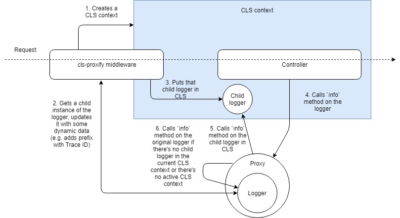

# cls-proxify [](https://travis-ci.org/aigoncharov/cls-proxify) [](https://coveralls.io/github/aigoncharov/cls-proxify?branch=master) [](https://twitter.com/intent/tweet?text=A%20small%20library%20that%20proxies%20any%20arbitrary%20object%20with%20a%20proxy%20from%20CLS.%20Super-useful%20for%20logging.&url=https://github.com/aigoncharov/cls-proxify&hashtags=javascript,library,nodejs,cls,proxy,logging)

Logging on steroids with CLS and Proxy. A small library that proxies any arbitrary object with a proxy from [Continuation-Local Storage a.k.a. CLS](https://github.com/jeff-lewis/cls-hooked) if found one. Super-useful for creating child loggers per each request with dynamic context from the request itself (e.g. adding request trace ID, adding request payload). Integrated with [express](https://github.com/expressjs/express), [koa](https://github.com/koajs/koa), [fastify](https://github.com/fastify/fastify) out-of-the-box.

Many thanks to [@mcollina](https://github.com/mcollina) for the idea of combining [Proxy](https://developer.mozilla.org/en-US/docs/Web/JavaScript/Reference/Global_Objects/Proxy) and [CLS](https://github.com/jeff-lewis/cls-hooked).

<!-- START doctoc generated TOC please keep comment here to allow auto update -->
<!-- DON'T EDIT THIS SECTION, INSTEAD RE-RUN doctoc TO UPDATE -->

- [Installation](#installation)
- [Quick start](#quick-start)
  - [Express](#express)
  - [Koa](#koa)
  - [Fastify](#fastify)
  - [Any other framework or library](#any-other-framework-or-library)
- [In depth](#in-depth)
  - [How it works](#how-it-works)
  - [Does it work only for loggers?](#does-it-work-only-for-loggers)
- [Live demos](#live-demos)
  - [Usage with pino and fastify](#usage-with-pino-and-fastify)
  - [Usage with pino and express](#usage-with-pino-and-express)
- [Troubleshooting](#troubleshooting)
  - [My context got lost](#my-context-got-lost)
  - [I'm experiencing a memory leak](#im-experiencing-a-memory-leak)

<!-- END doctoc generated TOC please keep comment here to allow auto update -->

## Installation

```
npm i cls-proxify cls-hooked
```

## Quick start

### Express

> TypeScript users, `clsProxifyExpressMiddleware` uses typings from `@types/express`. Please, run `npm i -D @types/express`

```ts
import { clsProxify } from 'cls-proxify'
import { clsProxifyExpressMiddleware } from 'cls-proxify/integration/express'
import * as express from 'express'

const logger = {
  info: (msg: string) => console.log(msg),
}
const loggerCls = clsProxify(logger)

const app = express()
app.use(
  clsProxifyExpressMiddleware((req) => {
    const headerRequestID = req.headers.Traceparent
    const loggerProxy = {
      info: (msg: string) => `${headerRequestID}: ${msg}`,
    }
    // this value will be accesible in CLS by key 'cls-proxify'
    // it will be used as a proxy for `loggerCls`
    return loggerProxy
  }),
)

app.get('/test', (req, res) => {
  loggerCls.info('My message!')
  // Logs `${headerRequestID}: My message!` into the console
  // Say, we send GET /test with header 'Traceparent' set to 12345
  // It's going to log '12345: My message!'
  // If it doesn't find anything in CLS by key 'cls-proxify' it uses the original `logger` and logs 'My message!'
})
```

### Koa

> TypeScript users, `clsProxifyKoaMiddleware` uses typings from `@types/koa`. Please, run `npm i -D @types/koa`

```ts
import { clsProxify } from 'cls-proxify'
import { clsProxifyKoaMiddleware } from 'cls-proxify/integration/koa'
import * as Koa from 'koa'

const logger = {
  info: (msg: string) => console.log(msg),
}
const loggerCls = clsProxify(logger)

const app = new Koa()
app.use(
  clsProxifyKoaMiddleware((ctx) => {
    const headerRequestID = ctx.req.headers.Traceparent
    const loggerProxy = {
      info: (msg: string) => `${headerRequestID}: ${msg}`,
    }
    // this value will be accesible in CLS by key 'cls-proxify'
    // it will be used as a proxy for `loggerCls`
    return loggerProxy
  }),
)

app.use((ctx) => {
  loggerCls.info('My message!')
  // Logs `${headerRequestID}: My message!` into the console
  // Say, we send GET / with header 'Traceparent' set to 12345
  // It's going to log '12345: My message!'
  // If it doesn't find anything in CLS by key 'cls-proxify' it uses the original `logger` and logs 'My message!'
})
```

### Fastify

```ts
import { clsProxify } from 'cls-proxify'
import { clsProxifyFastifyMiddleware } from 'cls-proxify/integration/fastify'
import * as fastify from 'fastify'

const logger = {
  info: (msg: string) => console.log(msg),
}
const loggerCls = clsProxify(logger)

const app = fastify()
app.use(
  clsProxifyFastifyMiddleware((req) => {
    const headerRequestID = ctx.req.headers.Traceparent
    const loggerProxy = {
      info: (msg: string) => `${headerRequestID}: ${msg}`,
    }
    // this value will be accesible in CLS by key 'cls-proxify'
    // it will be used as a proxy for `loggerCls`
    return loggerProxy
  }),
)

app.get('/test', (req, res) => {
  loggerCls.info('My message!')
  // Logs `${headerRequestID}: My message!` into the console
  // Say, we send GET /test with header 'Traceparent' set to 12345
  // It's going to log '12345: My message!'
  // If it doesn't find anything in CLS by key 'cls-proxify' it uses the original `logger` and logs 'My message!'
})
```

### Any other framework or library

```ts
import { clsProxify, clsProxifyNamespace } from 'cls-proxify'
import AbstractWebServer from 'abstract-web-server'

const logger = {
  info: (msg: string) => console.log(msg),
}
const loggerCls = clsProxify(logger)

const app = new AbstractWebServer()
// Assuming this AbstractWebServer supports some form of middlewares
app.use((request, response, next) => {
  // Assuming your request and response are event emitters
  clsProxifyNamespace.bindEmitter(request)
  clsProxifyNamespace.bindEmitter(response)

  clsProxifyNamespace.run(() => {
    const headerRequestID = request.headers.Traceparent
    // this value will be accesible in CLS by key 'cls-proxify'
    // it will be used as a proxy for `loggerCls`
    const loggerProxy = {
      info: (msg: string) => `${headerRequestID}: ${msg}`,
    }
    setClsProxyValue(loggerProxy)

    next()
  })
})

app.get('/test', (req, res) => {
  loggerCls.info('My message!')
  // Logs `${headerRequestID}: My message!` into the console
  // Say, we send GET /test with header 'Traceparent' set to 12345
  // It's going to log '12345: My message!'
  // If it doesn't find anything in CLS by key 'cls-proxify' it uses the original `logger` and logs 'My message!'
})
```

## In depth

### How it works

> If you're struggling to grasp the idea behind CLS at these two articles: [Request Id Tracing in Node.js Applications](https://itnext.io/request-id-tracing-in-node-js-applications-c517c7dab62d), [A Pragmatic Overview of Async Hooks API in Node.js](https://itnext.io/a-pragmatic-overview-of-async-hooks-api-in-node-js-e514b31460e9).

> Take a look at [this article which overviews how CLS works and covers the idea behind this library](https://itnext.io/nodejs-logging-made-right-117a19e8b4ce).

We wrap our original logger in a [Proxy](https://developer.mozilla.org/en-US/docs/Web/JavaScript/Reference/Global_Objects/Proxy). Every time we try to access any property of that object we first check if there's an updated logger in CLS available. If it's there we take the property from it. If it's not we take the property from the original logger. Then for every request we create a CLS context using `run` and `bindEmitter`. Once the context is created we enhance our original logger with some extra data and put the updated logger in the context. Once we try to call any method of our logger we'll actually call the same method on our logger in CLS.



### Does it work only for loggers?

No. You can proxify any object you want. Moreover you can even proxify functions and class constructors.

Here's a list of [traps](https://developer.mozilla.org/en-US/docs/Web/JavaScript/Reference/Global_Objects/Proxy#Terminology) cls-proxify provides:

- [get](https://developer.mozilla.org/en-US/docs/Web/JavaScript/Reference/Global_Objects/Proxy/handler/get)
- [apply](https://developer.mozilla.org/en-US/docs/Web/JavaScript/Reference/Global_Objects/Proxy/handler/apply)
- [construct](https://developer.mozilla.org/en-US/docs/Web/JavaScript/Reference/Global_Objects/Proxy/handler/construct)
- [ownKeys](https://developer.mozilla.org/en-US/docs/Web/JavaScript/Reference/Global_Objects/Proxy/handler/ownKeys)
- [has](https://developer.mozilla.org/en-US/docs/Web/JavaScript/Reference/Global_Objects/Proxy/handler/has)
- [getOwnPropertyDescriptor](https://developer.mozilla.org/en-US/docs/Web/JavaScript/Reference/Global_Objects/Proxy/handler/getOwnPropertyDescriptor)

Take a look at [the tests](https://github.com/aigoncharov/cls-proxify/blob/master/src/core.test.ts#L29) to get an idea of how you can utilize them.

## Live demos

#### [Usage with pino and fastify](https://repl.it/@aigoncharov/cls-proxify-pino-fastify)

#### [Usage with pino and express](https://repl.it/@aigoncharov/cls-proxify-pino-express)

## Troubleshooting

### My context got lost

Note that some middlewares may cause CLS context to get lost. To avoid it use any third party middleware that does not need access to request ids before you use this middleware.

### I'm experiencing a memory leak

Make sure you don't keep any external references to the objects inside of CLS. It may prevent them from being collected by GC.
Take a look at this issues: [#21](https://github.com/Jeff-Lewis/cls-hooked/issues/21), [#11](https://github.com/Jeff-Lewis/cls-hooked/issues/11).
